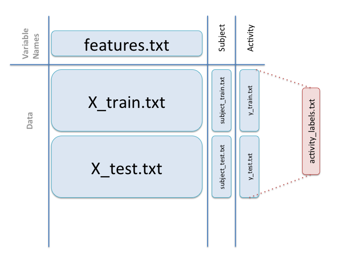

Overview
--------

The 'run_analysis.R' file contains all code to perform the tasks listed in the assignment. It will produce the file 'tidySet.txt' in the working directory which contains the tidy dataset in comma delimited format. 

To read this set into R:


```r
tidySet <- read.csv("tidySet.txt")
```

The tidy data set contains **180** observations.  

This corresponds to **6** different activities, each one being performed by **30** different participants ("subjects"). 

For each activity and subject **79** variables are observed. These are a subset of variables from the raw data which correspond to mean and standard deviation data. For each of these variables the average for the activity and subject is given.  

How it works
------------

The code works off the assumption that it is being run in a working directory that already contains the extracted data for analysis (i.e. "can be run as long as the Samsung data is in your working directory" as per the evaluation notes.)

Thus it will expect to be able to find and use the following files:  

|Filename & Path | Use |  
|----------------|-----|  
|"./UCI HAR Dataset/activity_labels.txt"|Names of each activity|  
|"./UCI HAR Dataset/features.txt"|Names of each variable in the 'X' datasets|  
|"./UCI HAR Dataset/test/subject_test.txt"|Subjects undertaking each activity|
|"./UCI HAR Dataset/test/X_test.txt"|All the measurements taken on each activity for each subject|  
|"./UCI HAR Dataset/test/y_test.txt"|Identifies the activity being undertaken in each of the observations in the 'X_test' dataset|  
|"./UCI HAR Dataset/train/subject_test.txt"|Subjects undertaking each activity|
|"./UCI HAR Dataset/train/X_test.txt"|All the measurements taken on each activity for each subject|  
|"./UCI HAR Dataset/train/y_test.txt"|Identifies the activity being undertaken in each of the observations in the 'X_train' dataset| 

The relationship between these files is described by the following diagram (taken from the discussion threads):  



Data in the "test/Inertial Signals" and "train/Inertial Signals" directories are ignored as they would later be excluded anyway on the basis of not containing data pertinent to mean or standard deviation.

**run_analysis.R** then processes these files to meet the 5 criterias given in the assignment text as follows:

##### 1. Merges the training and the test sets to create one data set.

The 'test' and 'training' datasets are each comprised of an 'X', 'y' and 'subjects' file.  

To merge the sets I start by reading each file into an R table and merging each 'test' table with its corresponding 'training' table.  

I hold off on merging these three merged tables into a single dataset until the second and third steps are complete.


##### 2. Extracts only the measurements on the mean and standard deviation for each measurement.

The 'X' datasets contain 561 variables. The names for these are stored in the 'features.txt' file.
I use the **grepl** function to create a TRUE/FALSE vector that corresponds to whether or not the variable name contains the strings "mean" or "std".  

Applying this vector I then subset the 'X' dataset to only contain those columns with either "mean" or "std" in the variable name.

##### 3. Uses descriptive activity names to name the activities in the data set.

The "activities_lables.txt" file contains the description of the six activities in the experiment. (STANDING, SITTING, LAYING, WALKING, WALKING_DOWNSTAIRS, WALKING_UPSTAIRS).  

I loop through the 'y' dataset and replace the activity number (1-6) with its matching description. 

##### 4. Appropriately labels the data set with descriptive variable names. 

At this point I merge the 'X' dataset with the 'subject' and 'y' datasets. As 'subject' and 'y' are single column datasets the last two columns in the merged set can just be named "Subject" and "Activity".   

For the 'X' dataset I use **grep** with the same regular expression used in **grepl** to pull the variable names list from the features.txt table (**"varNames"**) 

##### 5. From the data set in step 4, creates a second, independent tidy data set with the average of each variable for each activity and each subject.

The final step is to create a new data table (**tidySet**) which is the merged dataset grouped by the "Activity" and "Subject" variables and summarised by the mean of the other variables.  

This is then written to the working directory as a .txt file "tidySet.txt" with a comma separator.

References:
-----------
1. https://class.coursera.org/getdata-016/forum/thread?thread_id=50#comment-333 Link to the Data_Name_Mapping graphic by David Hood.
